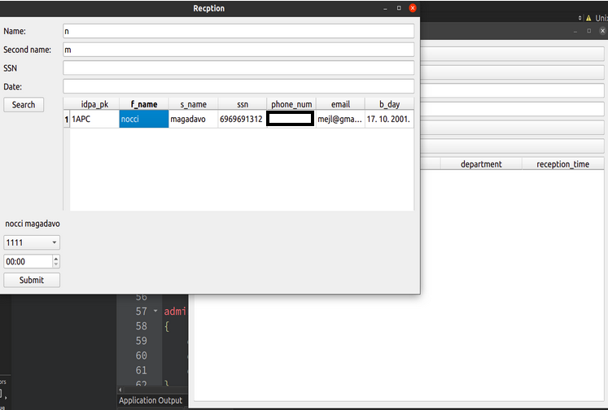

<h1>Patient Managment System</h1>

This project consists of three parts: 

<ol> 
<li> <a href ="#admin-panel">Admin panel  </a> </li>
<li> <a href ="#doctor's-program "> Doctor's program </a> </li>
<li> <a href ="#database"> Database </a> </li>
</ol>

<h3> <b> Admin Panel </b> </h3>
 

Admin Panel is a part of the system through which MYSQL database can be controlled.
Admin can create doctor's account and also delete it. 
 

 

To create account admin must input account's details and pass validation rules (name cannot have numbers and symbols, mail format must be valid, etc.)
Before password is stored in database it is encrypted using AES encryption

 
 

 <h2> <b> Doctor's program </b></h2>

 
 Doctor must enter valid credentials (email, password) in order to login. 
 
 After successful login, doctor can search for patients that were registered that day. Doctor can use name, last name, doctor's id to make search for patients easier. 

 

 If doctor wants to receive patient and register it in daily patients he can search for patients from table that stores registered patients in canton, city, country. 
 
 Doctors can use many filters in order to find patient easier. For example, patients's name that starts with "n".
 
Doctor can delete received patient by clicking on row where patient is stored and pressing button "Delete".
 
SQL queries for filtering can be found in files "patientsinfo.cpp" method "on_filterButton_clicked()" and "patientsreception.cpp" method "on_SearchButton_clicked()".

 

<h2> Database </h2>
 
 Database has 4 tables:

<ol>
<li> Doctor's accounts </li>
<li>  Doctors</li>

<li> Patients db</li>
<li> Daily patients  </li>
</ol>

 Doctor's account table 

Doctors

 

Patients db

 

 
Daily patients

 

